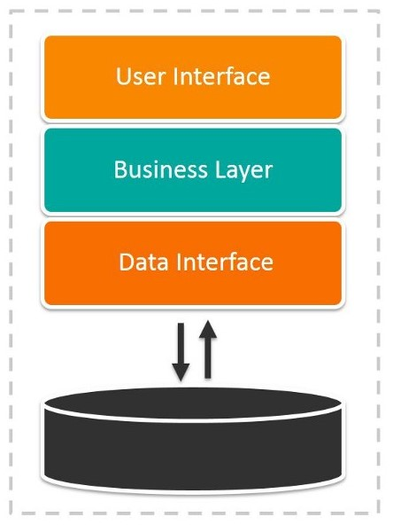
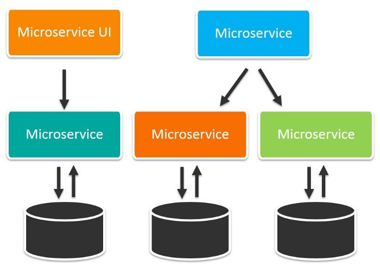
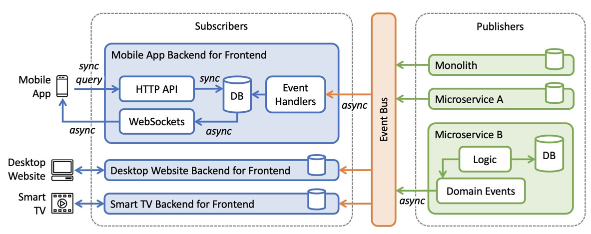
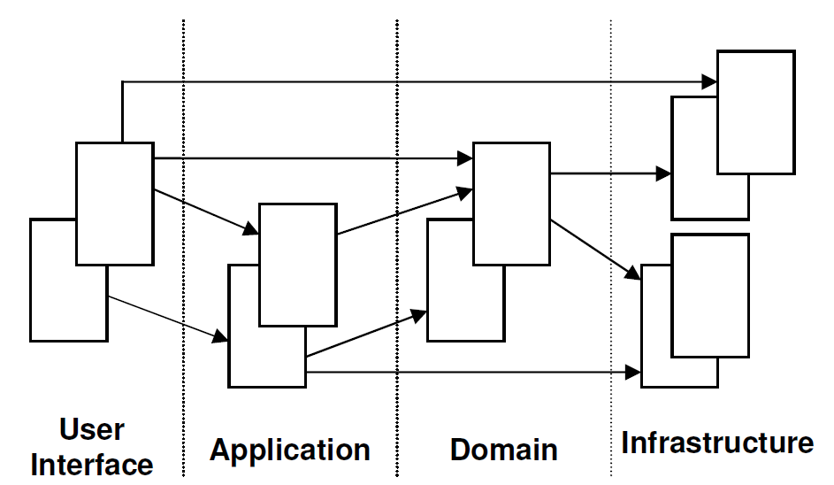

# Microsserviços, BFF e DDD
## Monolithic Architecture
Arquitetura monolítica é o modelo tradicional do programa de software, que é construído como unidade unificada e é autossuficiente e independente de outros aplicativos. A palavra "monólito" é quase sempre atribuída a algo grande e glacial, que não está longe na verdade da arquitetura de monólito para design de software. A arquitetura monolítica é a rede de computação grande e singular com base de código que une todas as preocupações empresariais. Para fazer alteração nesse tipo de aplicativo é necessário atualizar toda a pilha acessando a base de código e criando e implementando a versão atualizada da interface do lado do serviço. Assim, as atualizações se tornam restritivas e demoradas.

Os monólitos podem ser convenientes no início da vida de um projeto para facilitar a sobrecarga cognitiva de gerenciamento de código e a implementação. Assim tudo no monólito pode ser lançado de uma só vez.

### Vantagens da arquitetura monolítica
As empresas podem se beneficiar da arquitetura monolítica ou de microsserviços, dependendo de vários fatores diferentes. Ao desenvolver usando a arquitetura monolítica, a principal vantagem é o desenvolvimento rápido devido à simplicidade de ter o aplicativo com base na base de código.

#### As vantagens da arquitetura monolítica incluem:
**Fácil implementação:** Um arquivo executável ou diretório facilita a implementação.

**Desenvolvimento:** Quando o aplicativo é construído com uma base de código, é mais fácil de desenvolver.

**Desempenho:** Na base de código e repositório centralizados, muitas vezes uma API pode executar a mesma função que várias APIs executam com microsserviços.

**Testes simplificados:** Como o aplicativo monolítico é a unidade única e centralizada, o teste de ponta a ponta pode ser realizado com mais rapidez do que com o aplicativo distribuído.

**Fácil depuração:** Com todo o código localizado em um só lugar, é mais fácil seguir a solicitação e encontrar o item.

### Desvantagens da arquitetura monolítica
Os aplicativos monolíticos podem ser bastante eficazes até ficarem muito grandes e a escalabilidade se tornar um desafio. Fazer alterações, mesmo que pequenas, em uma única função requer compilar e testar em toda a plataforma, o que vai contra a abordagem ágil que os desenvolvedores de hoje preferem.

#### As desvantagens do monólito incluem:

**Velocidade de desenvolvimento mais lenta:** O aplicativo grande e monolítico torna o desenvolvimento mais complexo e lento.

**Escalabilidade:** Não é possível dimensionar componentes individuais.

**Confiabilidade:** Se houver erro em qualquer módulo, isso pode afetar a disponibilidade de todo o aplicativo.

**Barreira para adoção de tecnologia:** Qualquer alteração na estrutura ou na linguagem afeta todo o aplicativo, tornando as alterações muitas vezes caras e demoradas.

**Falta de flexibilidade:** O monólito é limitado pelas tecnologias já usadas no monólito.

**Implementação:** Uma pequena alteração no aplicativo requer a reimplementação de todo o monólito.

## Micorservices Architecture
A arquitetura de microsserviço, também conhecida como microsserviços, é o método arquitetônico que depende da série de serviços implantáveis com independência. Esses serviços têm sua própria lógica de negócios e banco de dados com objetivo específico. A atualização, o teste, a implementação e a escalabilidade ocorrem em cada serviço. Os microsserviços dissociam os principais problemas específicos dos domínios de negócios em bases de código independentes. Os microsserviços não reduzem a complexidade, mas tornam qualquer complexidade visível e mais gerenciável, separando as tarefas em processos menores que funcionam independentes uns dos outros e contribuem para o todo.

A adoção do microsserviços muitas vezes anda de mãos dadas com o DevOps, pois eles são base para práticas de entrega contínua que permitem que as equipes se adaptem com rapidez aos requisitos do usuário.

### Vantagens dos microsserviços
**Agilidade:** Promova maneiras ágeis de trabalhar com equipes pequenas que implementam com frequência.

**Escalabilidade flexível:** Se os microsserviços atingirem a capacidade de carga, novas instâncias desse serviço vão poder ser implementadas com rapidez no cluster que o acompanha para ajudar a aliviar a pressão. Agora somos multilocatários e sem estado, com clientes espalhados por várias instâncias e podemos oferecer suporte a tamanhos de instância muito maiores.

**Implementação contínua:** Agora temos ciclos de lançamento mais rápidos e mais frequentes. Antes, lançávamos atualizações uma vez por semana e agora podemos realizar essa tarefa cerca de duas a três vezes por dia.

**Bastante sustentável e testável:** As equipes podem experimentar novos recursos e reverter se algo não funcionar. Isso facilita a atualização do código e acelera o tempo de entrada no mercado para novos recursos Além disso, é fácil isolar e corrigir falhas e bugs em serviços individuais.

**Implementável com independência:** Como os microsserviços são unidades individuais, é permitida uma implementação independente rápida e fácil de recursos individuais.

**Flexibilidade tecnológica:** As arquiteturas de microsserviços permitem que as equipes tenham a liberdade de selecionar as ferramentas que querem.

**Alta confiabilidade:** Você pode implementar alterações para o serviço específico, sem a ameaça de derrubar todo o aplicativo.

### Desvantagens dos microsserviços

**Expansão do desenvolvimento:** Os microsserviços adicionam mais complexidade em comparação com a arquitetura monolítica, já que há mais serviços em mais lugares criados por várias equipes. Se a expansão do desenvolvimento não for gerenciada de modo adequado, a velocidade de desenvolvimento fica mais lenta e o desempenho operacional ruim.

**Custos exponenciais de infraestrutura:** Cada novo microsserviço pode ter o custo próprio para o conjunto de testes, esquema tático de implementação, infraestrutura de hospedagem, ferramentas de monitoramento e mais.

**Sobrecarga organizacional adicional:** As equipes precisam adicionar outro nível de comunicação e colaboração para coordenar atualizações e interfaces.

**Desafios de depuração:** Cada microsserviço tem o conjunto de registros próprio, o que torna a depuração mais complicada. Além disso, o processo de negócios pode ser executado em várias máquinas, complicando ainda mais a depuração.

**Falta de padronização:** Sem a plataforma comum, pode haver a proliferação de linguagens, padrões de registro e monitoramento.

**Falta de propriedade clara:** À medida que mais serviços são introduzidos, o mesmo acontece com o número de equipes que executam esses serviços. Com o tempo, se torna difícil conhecer os serviços disponíveis que a equipe pode aproveitar e com quem entrar em contato para obter suporte.

## Backend For Frontend (BFF)
### The BFF pattern
De acordo com <a href="https://samnewman.io/patterns/architectural/bff/">Sam Newman</a>, o padrão Backend For Frontend (BFF) refere-se a ter um back-end por experiência do usuário, em vez de ter apenas um back-end de API de uso geral.

Tradicionalmente, a abordagem para acomodar mais de um tipo de UI é fornecer uma única API do lado do servidor e adicionar mais funcionalidades conforme necessário ao longo do tempo para suportar novos tipos de interação móvel. Os seguintes desafios podem resultar desta abordagem:

Os dispositivos móveis fazem menos chamadas e desejam exibir dados diferentes (e provavelmente menos) do que seus equivalentes em desktop – isso significa que os back-ends da API precisam de funcionalidade adicional para suportar interfaces móveis.
As interfaces de usuário de aplicativos modernos estão adotando cada vez mais estratégias reativas para fornecer feedback em tempo real aos usuários finais (por exemplo, via WebSockets ), e diferentes dispositivos podem implementar diferentes pilhas de tecnologia para suportá-lo.
Os back-ends de API fornecem, por definição, funcionalidade para vários aplicativos voltados para o usuário – isso significa que o back-end de API único pode se tornar um gargalo ao implementar uma nova entrega, devido às muitas alterações feitas no mesmo artefato implantável.

Components of an event-driven BFF

## Domain Driven Design (DDD)
A principal ideia do DDD é a de que o mais importante em um software não é o seu código, nem sua arquitetura, nem a tecnologia sobre a qual foi desenvolvido, mas sim o problema que o mesmo se propõe a resolver, ou seja, a regra de negócio. Ela é a razão do software existir, por isso deve receber o máximo de tempo e atenção possíveis. Em projetos de software, a complexidade não está localizada nos aspectos técnicos, mas sim no negócio, na atividade que é exercida pelo cliente ou problema que o mesmo possui. Eric Evans, em seu livro diz que, esse é o “coração”, o ponto central de qualquer aplicação, portanto todo o resto deve ser trabalhado de forma que este “coração” seja entendido e concebido da melhor forma possível.

O domínio é o ponto central de qualquer aplicação, é por causa dele que o software é criado. O domínio concentra a maior parte da complexidade de quase todos os projetos de software. O que muitas vezes acontece é um foco excessivo em aspectos técnicos, em detrimento de um conhecimento mais aprofundado no domínio. Para desenvolver uma aplicação de qualidade, que atenda todas as necessidades do cliente de forma satisfatória, não basta apenas ter muito conhecimento técnico e utilizar os melhores frameworks e plataformas, é necessário que a equipe do projeto tenha uma clara compreensão sobre o problema que o software se propõe a resolver, pois é isso que realmente traz valor ao produto final.

### Linguagem Ubíqua
A linguagem ubíqua (do inglês Ubiquitous Language), é a linguagem comum, conhecida por todos os envolvidos no projeto, é o “vocabulário” do projeto, e tem como objetivo viabilizar a comunicação entre desenvolvedores e especialistas de maneira mais natural, para que todos possam contribuir de forma satisfatória nas discussões sobre o domínio. Em alguns casos será necessário abstrair alguns conceitos, mas em outros pode ser que um esclarecimento sobre determinado ponto seja importante para o projeto como um todo.

### Arquitetura em Camadas
Para que possamos atingir o principal objetivo do DDD, que é focar no domínio da aplicação, é necessário que a arquitetura da mesma seja pensada de forma a permitir essa distinção. Pensando nisso é que o DDD sugere uma arquitetura padrão, que tem como objetivo principal separar o modelo do domínio da tecnologia em si, facilitando assim eventuais mudanças nas regras de negócio da aplicação.

Arquitetura padrão sugerida pelo DDD

## Referências
https://www.atlassian.com/br/microservices/microservices-architecture/microservices-vs-monolith

https://www.devmedia.com.br/ddd-domain-driven-design-com-net/14416
